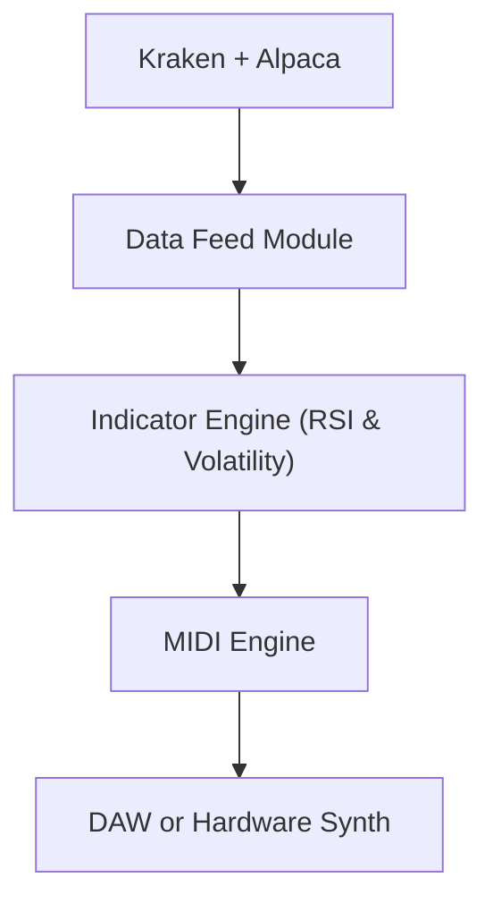

#  Market Sonifier

Market Sonifier is a real-time market data **sonification instrument**.  
It converts live market data from **Kraken (crypto)** and **Alpaca (stocks)** into **MIDI music**, allowing you to "hear" the market as it moves.

This project serves as both a research tool and the core of a future market performance art system.

---

##  Features

- Real-time price data from **Kraken** and **Alpaca** APIs
- Maps prices, volume, RSI trends to musical notes, chords, and percussion hits
- Modular class-based Python design
- Sends live MIDI output to any DAW or synthesizer
- Expandable to other exchanges and data feeds
- Future-proof structure for adding visuals, indicators, or plugins

---

##  Concept

Each market becomes a unique voice:
- **Crypto assets (BTC, ETH)** → synth bass & melody lines  
- **Stocks (AAPL, MSFT)** → harmony or arpeggios  
- **Volume spikes** → percussion hits  
- **RSI** controls tempo / mood shifts  

You can literally **hear market volatility and trends** as an evolving musical performance.

---

##  Installation

### 1️ Clone the repository

```bash
git clone https://github.com/decayboy/market-sonifier.git
cd market-sonifier
```
### 2️⃣ Install dependencies
```bash
pip install -r requirements.txt
```
### 3️⃣ Set API Keys
Edit ```core/config.py:```

Kraken: ```KRAKEN_API_KEY```, ```KRAKEN_SECRET```

Alpaca: ```ALPACA_API_KEY```, ```ALPACA_SECRET```

Use Alpaca's [paper trading API](https://alpaca.markets/learn/start-paper-trading) for safe testing.

## Running
```
python main.py
```

## System Architecture


## Disclaimers

This software is licensed under a proprietary license.
See ```LICENSE.txt``` for full terms.
You may not redistribute, modify, or sell without express written consent from the author.

Market Sonifier is not financial advice.
It is intended for research, creative, and educational purposes only.

Use of Kraken or Alpaca APIs must comply with their individual terms of service.

This project is provided as proprietary software with source available for evaluation and research.
For commercial licensing inquiries, please contact:


Email: William / billymadison30@gmail.com

See full legal terms in ```LICENSE.txt```.

## Acknowledgements
This project entirely draws inspiration from data sonification research, generative music systems, and experimental art.

---

[](LICENSE.txt)

> **Notice:**  
> Market Sonifier is proprietary software.  
> The source code is provided for personal, academic, and evaluation purposes only.  
> Redistribution, modification, or commercial use is strictly prohibited without prior written consent from William Madison.  
> See [`LICENSE.txt`](LICENSE.txt) for full legal terms.

---


